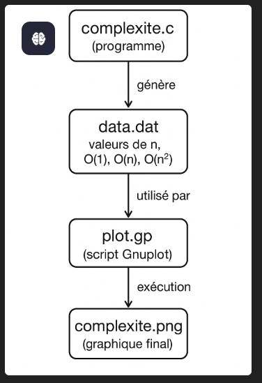

# Courbe évolutive de la complexité des algorithmes

Ce projet en **C** génère un graphique illustrant l'évolution de la complexité des algorithmes : **O(1), O(n), O(n²)**.

---

## Fonctionnalités

- Génère un fichier de données `data.dat`
- Crée un script Gnuplot `plot.gp`
- Trace un graphique PNG `complexite.png` avec les courbes
- Permet de visualiser comment la complexité croît avec la taille de l’input

---

## Prérequis

- **GCC** (ou un compilateur C compatible)
- **Gnuplot** installé sur votre machine
- Visual Studio Code ou tout éditeur de texte

---

## Compilation

Ouvrir un terminal dans le dossier du projet et exécuter :

```bash
gcc -O2 -o complexite complexite.c

## Exécution

./complexite


Le programme va générer :

data.dat → fichier contenant les valeurs pour O(1), O(n) et O(n²)

plot.gp → script Gnuplot pour tracer les courbes

complexite.png → graphique final des courbes


┌───────────────┐
│ complexite.c  │
│  (programme)  │
└───────┬───────┘
        │ génère
        ▼
┌───────────────┐
│   data.dat    │  ← valeurs de n, O(1), O(n), O(n²)
└───────┬───────┘
        │ utilisé par
        ▼
┌───────────────┐
│   plot.gp     │  ← script Gnuplot
└───────┬───────┘
        │ exécution
        ▼
┌───────────────┐
│ complexite.png│  ← graphique final
└───────────────┘


